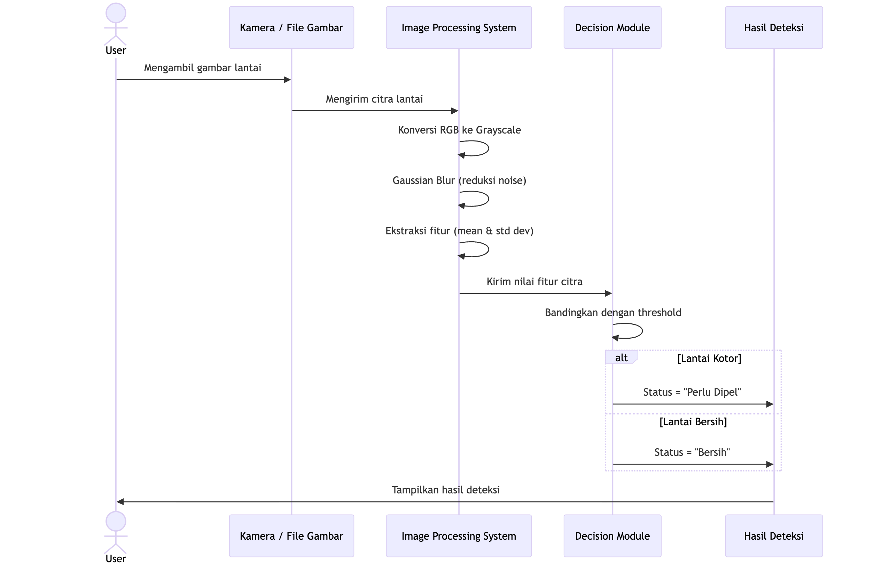

```md
# Deteksi Lantai Keramik Kotor

Proyek ini bertujuan untuk membedakan kondisi lantai keramik **bersih** dan **kotor** menggunakan teknik pengolahan citra digital.  
Pendekatan yang digunakan berbasis analisis intensitas piksel dan variasi tekstur tanpa melibatkan pembelajaran mesin.

---

## Kebutuhan

- Python 3.8 atau lebih baru
- OpenCV
- NumPy
- Matplotlib

Semua dependensi dapat dipasang melalui `requirements.txt`.

---

## Struktur Singkat
```

.
├── deteksi_lantai_kotor.py
├── requirements.txt
├── lantai.jpg
└── docs/
└── sequence-diagram.png

````

---

## Alur Sistem



**Ringkas:**
1. Sistem membaca citra lantai keramik.
2. Citra dikonversi ke grayscale dan dilakukan reduksi noise.
3. Sistem mengekstraksi fitur statistik (mean dan standar deviasi).
4. Nilai standar deviasi dibandingkan dengan threshold.
5. Sistem menentukan kondisi lantai (bersih atau kotor).

---

## Cara Menjalankan

```bash
pip install -r requirements.txt
python deteksi_lantai_kotor.py

````

Pastikan file gambar (`lantai.jpg`) berada pada path yang sesuai dengan yang ditentukan di dalam kode.

---

## Output

- Tampilan visual citra asli, hasil preprocessing, dan hasil deteksi
- Informasi nilai mean, standar deviasi, dan keputusan sistem ditampilkan melalui terminal

---

## Catatan

- Sistem bekerja optimal pada kondisi pencahayaan yang relatif stabil.
- Nilai threshold dapat disesuaikan berdasarkan hasil pengujian pada lingkungan yang berbeda.
